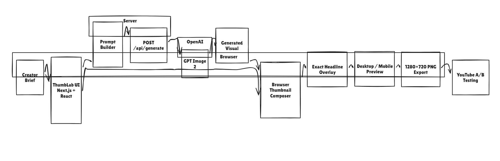

# ThumbLab

**One brief. Three testable thumbnails.**

ThumbLab is an A/B-ready YouTube thumbnail studio. A creator describes one real
video and gets three intentionally different visual directions:

- **Clarity** — make the topic immediately obvious.
- **Curiosity** — create a truthful visual question.
- **Emotion** — lead with visual energy.

The creator compares the variants, edits the headline locally with exact
typography, checks a YouTube-style feed preview, and exports PNGs for YouTube's
native thumbnail experiment. ThumbLab does not invent CTR scores or claim to
predict the winner.

## Why this exists

Prompt-to-image-to-download is no longer a useful product wedge by itself.
ThumbLab keeps the AI focused on visual ideation and turns one brief into three
meaningfully different packaging hypotheses that can be tested in the real
platform workflow.

The headline is deliberately not generated inside the image. The browser
renders it deterministically, so spelling, position, color, outline, and
downloaded output stay under creator control.

## Workflow

1. Enter the video title, context, headline, audience, style, and emotional direction.
2. Generate Clarity, Curiosity, and Emotion with the real OpenAI image provider.
3. Compare the variants at full size and in desktop/mobile feed previews.
4. Adjust deterministic headline typography or refine one visual direction.
5. Download the current PNG or every successful variant.
6. Upload the exported images to YouTube's own A/B testing workflow.

## Architecture diagram

## Screenshots

## Architecture

The app is intentionally small:

Browser creator brief
→ shared prompt builder
→ POST /api/generate
→ GPT Image 2
→ base64 image response
→ browser headline compositor
→ downloadable 1280×720 PNG

There is no database, authentication, account system, queue, worker, file
storage, YouTube OAuth, YouTube upload, analytics backend, or payment flow.
The only server responsibility is validating the request, compiling the
trusted prompt, calling the provider, and returning the real image.

## Stack

- Next.js App Router
- TypeScript and React
- Tailwind CSS 4
- OpenAI Node SDK and GPT Image 2
- Zod request validation
- Phosphor Icons
- Vitest deterministic logic tests

## Local setup

Requirements:

- Node.js 20.9 or newer
- An OpenAI API key with access to image generation

Install and start:

    corepack pnpm install
    cp .env.example .env.local
    corepack pnpm dev

Open http://localhost:3000.

Set OPENAI_API_KEY in .env.local. The key is read only by the server route and
is never included in a NEXT_PUBLIC variable, client response, or prompt
inspector.

GPT Image access may require organization verification and can be limited by
project quota, rate limits, moderation, or provider latency. ThumbLab surfaces
those failures; it never substitutes a fake image or fake success state.

## Project links

- Live app: https://thumblab-chi.vercel.app/
- Loom walkthrough: https://www.loom.com/share/6fed8ff387014dcb8f0b3f2800986fa4
- Vimeo demo: https://vimeo.com/1216362360?share=copy&fl=sv&fe=ci
- Source code: https://github.com/0xshobha/thumblab

## Commands

    corepack pnpm format
    corepack pnpm lint
    corepack pnpm typecheck
    corepack pnpm test
    corepack pnpm build
    corepack pnpm check

The local API boundary can be checked without a key:

    curl -i -X POST http://localhost:3000/api/generate \
      -H 'Content-Type: application/json' \
      -d '{"videoTitle":"I built an AI agent","videoDescription":"A practical walkthrough of an agent that automates repetitive startup work.","headline":"MY AI CEO","audience":"founders","visualStyle":"tech","emotion":"curiosity","subjectPlacement":"auto","headlinePosition":"left","accentColor":"#d7ff4f","strategy":"clarity"}'

Without OPENAI_API_KEY, this request must return a clear
missing_configuration error. With a valid configured key, it makes one real
GPT Image 2 request and returns a data URL for the generated PNG.

You can also run:

    corepack pnpm smoke:generate

This posts one valid brief to `/api/generate` and prints whether the response is a real
generated base64 PNG (`success`) or a provider/configuration error (`missing_configuration`, `provider_error`, etc.).

## How generation works

The frontend and server import the same lib/prompt-builder.ts function. The
Prompt Inspector shows the same compiled recipe sent to the provider. Dynamic
creator fields are treated as descriptive data inside a trusted prompt
envelope; they cannot replace the no-text, truthful-composition requirements.

Generate Trio sends three independent requests. Successful results remain
available if another strategy fails. A failed strategy can be retried without
discarding successful results. Refinement regenerates only the selected
strategy, retaining the prior image until the replacement succeeds.

## Deterministic typography and export

The visible preview uses an HTML overlay. Download uses a browser canvas at
1280×720, draws the provider image, wraps the exact headline, applies a bold
fill and outline, and exports a PNG. Changing headline text, size, position,
fill, or outline never calls the image provider.

## Honest limitations

- Provider latency can be significant; a generation may take up to a couple of minutes.
- The image provider may still place visual details imperfectly.
- The three outputs are creative hypotheses, not a prediction or guarantee of performance.
- YouTube upload and experiment setup remain creator actions.
- No local persistence is implemented; refreshing the page clears the current work.
- A configured API key and provider access are required for real image generation.

## Project structure

- app/page.tsx — entry screen.
- app/api/generate/route.ts — server-only provider boundary.
- components/thumbnail-studio.tsx — client workflow and state.
- components/creator-brief.tsx — concise creator controls.
- components/thumbnail-composer.tsx — image and deterministic headline preview.
- components/feed-preview.tsx — desktop/mobile YouTube-style preview.
- components/prompt-inspector.tsx — transparent generation recipe.
- lib/prompt-builder.ts — shared trusted prompt composition.
- lib/validation.ts — request-boundary validation.
- lib/export-thumbnail.ts — wrapping and PNG export helpers.

## Hackathon demo

Use one real brief, for example:

- Video title: I built an AI agent that runs my startup
- Headline: MY AI CEO
- Style: Tech
- Emotion: Curiosity

Show the trio being generated, switch between all three strategies, change the
headline position or size without another generation, use the feed preview,
open Generation Recipe, and download the successful variants. End by showing
that the outputs are designed for YouTube's native A/B test rather than a
fabricated in-app score.
